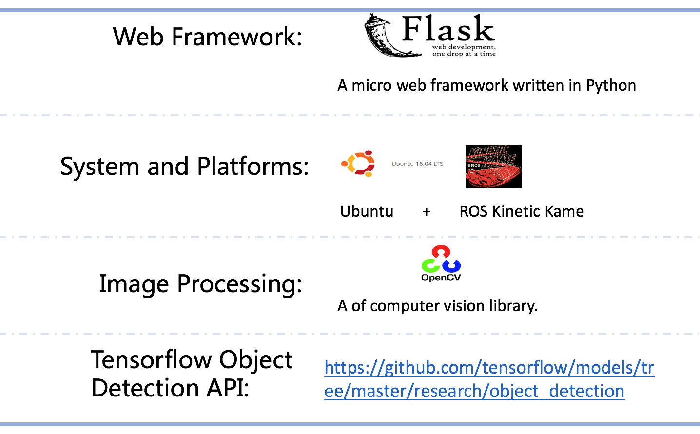

# Cloud-Robot-ROS

Training Project Cloud Robot Based on ROS

中山大学数据科学与计算机学院软件工程软件综合实训项目

面向机器人的软件设计与开发实训


## 1. 项目架构

### 1.1 技术栈




### 1.2 系统总览


### 1.3 系统流程


### 1.4 数据库设计


## 2. 项目配置

开发环境：Ubuntu 16.04

开发平台：ROS Kinetic Kame

Python: python3.5

C++: C++11

### 2.1 Ubuntu16.04 安装 python3.5

在终端下输入以下命令：

```shell
# 安装python3.5
$ sudo apt-get install python3

# 安装pip
$ sudo apt install python-pip
```


### 2.2 配置virtualenv

在终端下输入以下命令：

```shell
# 安装virtualenv
$ sudo pip install virtualenv

# 创建rosenv
$ virtualenv rosenv -p /usr/bin/python3.5

# 在创建rosenv路径下执行以下命令使用虚拟环境
$ source rosenv/bin/activate

# 在项目路径下执行下面命令安装依赖包
$ pip install -r requirements.txt
```


### 2.3 配置Tensorflow物体识别模块

```shell
# 在创建rosenv路径下执行以下命令使用虚拟环境
$ source rosenv/bin/activate

# for Ubuntu Python 3.5
$ pip3 install --upgrade https://storage.googleapis.com/tensorflow/linux/cpu/tensorflow-1.6.0-cp35-cp35m-linux_x86_64.whl

# 验证Tensorflow安装成功
$ python
# Python
import tensorflow as tf
hello = tf.constant('Hello, TensorFlow!')
sess = tf.Session()
print(sess.run(hello))
# 如果系统输出以下内容，就说明安装成功：
Hello, TensorFlow!

# 下载tensorflow/models
$ git clone https://github.com/tensorflow/models.git

# 安装需要的包
$ sudo apt-get install protobuf-compiler python-pil python-lxml python-tk

# 安装COCO API
$ git clone https://github.com/cocodataset/cocoapi.git
$ cd cocoapi/PythonAPI
$ make
$ cp -r pycocotools <path_to_tensorflow>/models/research/

# 在/models/research/目录下编译Protobuf
$ protoc object_detection/protos/*.proto --python_out=.

# 在/models/research/目录下通过pwd获取完整路径
$ pwd
# 将pwd输出的路径在添加到~/.bashrc中
export PYTHONPATH=$PYTHONPATH:`pwd`:`pwd`/slim
# 使修改后的配置生效
$ source ~/.bashrc

# 验证安装models安装成功
$ python object_detection/builders/model_builder_test.py
```


### 2.4 训练物体识别模型 

请查看 **TrainingModel.pdf**


## 3. 文件结构

```
|-ROS_Object_Detection/
    |-images/                       # github README 引用图片
    |-raccoon_dataser/              # 浣熊数据集
    |-srv/                          # 存放定义的服务
        |-Img.src                   # 定义传输图片服务
    |-scripts/                      # 脚本文件夹
        |-datbase/                  # 数据库文件夹
            |-origins/              # 存放原图片文件夹
            |-tagged/               # 存放待标记和已标记图片文件夹
            |-results/              # 存放识别后的结果图片文件夹
            |-database.py           # 配置数据库
        |-object_detection/         # 物体识别模块
        |-static/                   # 静态文件
            |-css/                  # css样式文件
                |-style.css
            |-js/                   # js文件
                |-jquery.js
                |-load.js
                |-upload.js
            |-images/               # 项目相关图片、图标
        |-templates/                # html模版
            |-base.html
            |-index.html
            |-result.html
        |-cloud_server.py           # 服务器节点
        |-db_manage.py              # 管理数据库脚本
        |-robot_client.py           # 客户端节点
        |-obj_detect.py             # 物体检测识别
        |-web_server.py             # web端
    |-CMakeLists.txt                # 程序包元信息
    |-package.xml                   # 软件包清单
    |-README.md                     # README
    |-requirements.txt              # python依赖包文件
```


## 4. 运行项目

```shell
# 每次运行时需要先进入虚拟环境rosenv
# 通过在创建rosenv虚拟环境的路径下执行命令启动rosenv虚拟环境
$ source rosenv/bin/activate

# 进入工作空间下的src文件夹
$ cd ~/catkin_ws/src
$ git clone https://github.com/Songkc/ROS_Object_Detection.git

# 回到工作空间进行编译程序包并运行setup.bash脚本
$ cd ~/catkin_ws
$ catkin_make
$ . ~/catkin_ws/devel/setup.bash

# 进入项目脚本文件夹
$ roscd rosproject/scripts

# 后台运行roscore
$ nohup roscore &

# 运行web服务器
$ rosrun rosproject web_server.py

---

# 打开另一个终端，同样先进入虚拟环境
$ source rosenv/bin/activate

# 运行setup.bash脚本
$ . ~/catkin_ws/devel/setup.bash

# 接着进入到项目脚本文件夹目录下运行Server节点
$ roscd rosproject/scripts
$ rosrun rosproject cloud_server.py
```


## 团队协作

Tower: <https://tower.im/projects/b6a5296a02404e99a69ec330ca8bcb3f/>